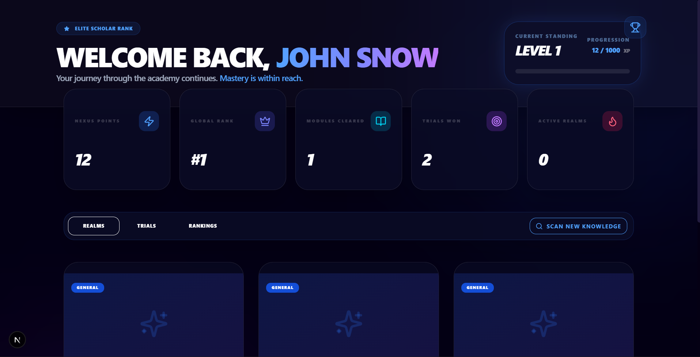
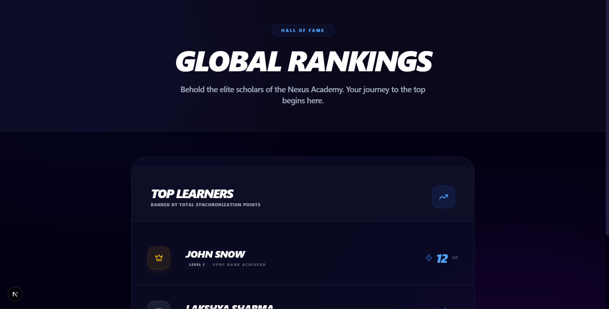
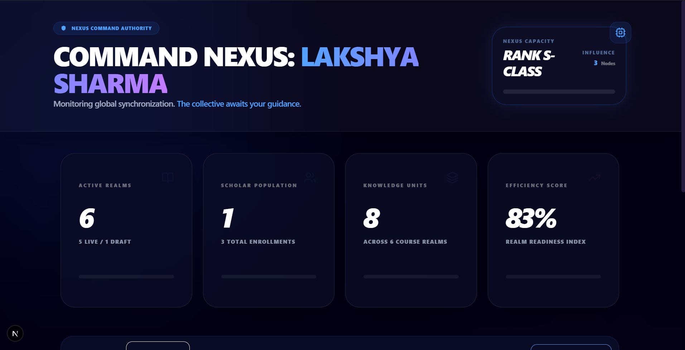

 🌌 LEARNIFY 

[](https://nextjs.org/)
[](https://tailwindcss.com/)
[](https://www.mongodb.com/)
[](https://opensource.org/licenses/MIT)

 **Welcome to Learnify.** This isn't just a standard LMS—it's a high-performance training environment designed with a modern, gamified "Nexus" aesthetic.

---

## 🖥️ Interactive Dashboards

Experience a premium dark theme designed for maximum focus and visual excellence.

### 🛡️ Student Dashboard
Track your progress, monitor your Experience Points (XP), and manage your enrolled courses.



A Global Leaderboard to be at the top!



### 🦾 Teacher Dashboard
Manage your student registry, create new courses (Knowledge Realms), and design technical assessments.



---

## 🚀 Key Features

- **📚 Course Management**: Organize content into realms with categorized domains and difficulty levels.
- **⚡ Lessons & Modules**: Break down courses into lessons (Knowledge Nodes) for structured learning.
- **📋 Quizzes & Assessments**: Create dynamic multiple-choice tests (Neural Trials) to verify student knowledge.
- **🏆 Gamified Leaderboard**: Real-time rank tracking for top-performing students in the collective.
- **📊 Performance Analytics**: Comprehensive insights for teachers to monitor enrollment and student progress.
- **🛡️ Secure Auth**: Robust role-based authentication for both students and teachers.

---

## 🛠️ Tech Stack

| Layers | Technologies |
| :--- | :--- |
| **Foundation** | Next.js 15 (App Router), TypeScript |
| **Database/Auth** | MongoDB (Mongoose), NextAuth.js |
| **UI/UX** | Tailwind CSS, Lucide React, Shadcn/UI |
| **State** | React Hooks (Server & Client Components) |

---

## 🛰️ Setup & Installation

### 1. Clone the Source
```bash
git clone https://github.com/Vishu-Manjhi/gamified-learning-management-system.git
cd gamified-learning-management-system
```

### 2. Environment Configuration
Create a `.env.local` file in the root directory:
```env
MONGODB_URI=your_mongodb_atlas_connection_string
NEXTAUTH_SECRET=your_secret_key
NEXTAUTH_URL=http://localhost:3000
```

### 3. Install Dependencies
```bash
npm install
```

### 4. Run Locally
```bash
npm run dev
```
Open [http://localhost:3000](http://localhost:3000) to access the system.

---

## 🗺️ Project Structure

```bash
├── app/                  # Main application routes
│   ├── auth/             # Authentication protocols
│   ├── teacher/          # Teacher management sectors
│   └── courses/          # Course content and enrollment
├── components/           # UI Modules & Stat Cards
├── models/               # Database Schema Manifests
├── lib/                  # Helper utilities (DB, Auth)
└── public/               # Visual Assets & Screenshots
```

---

## 🤝 Contribution
Want to expand the Nexus? Pull requests are welcome for new UI modules or gamified features.

---

Developed with <3 at **Learnify**.
